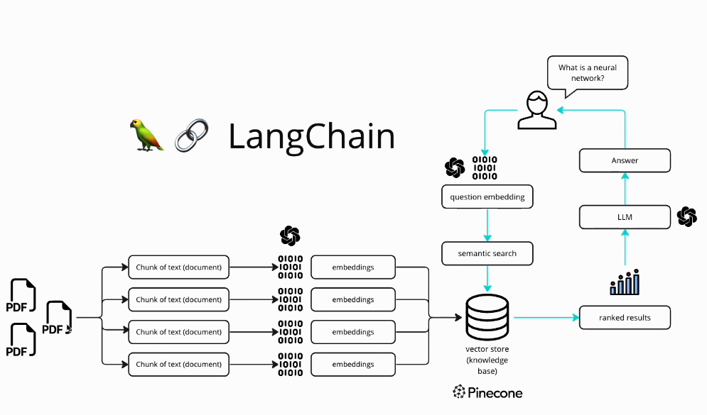

# What is it

DocSage is personalized chatbot to read data from inserted files and then provide answers to your queries.

[Reference](https://www.youtube.com/watch?v=dXxQ0LR-3Hg)
---

## The basic workflow diagram 



#### Step 1

Extract/Scrap entire content of PDF using `get_text_from_pdf` function.

#### Step 2

Break that raw text into chunks (pieces of text) using `get_chunks` function, each has size 10000(characters per chunk) and 1000 (characters per chunk) overlap which is essential for two seperate chunks to make sense and connect.

**Reason of chunking (According to google)** : Smaller chunks of data use less memory, accelerate retrieval times, enable parallel processing of data, and allow scaling of the database. Breaking content down into smaller parts can improve the relevance of content that's retrieved from a vector database, as well.

#### Step 3

Now convert these chunks into embeddings using `GoogleGenerativeAIEmbeddings` function. 

What does embedding mean (According to google) : Embeddings are numerical representations of real-world objects that machine learning (ML) and artificial intelligence (AI) systems use to understand complex knowledge domains like humans do.

[3Blues1Brown video perfectly explains how is a word converted into vector and how does a LLM predict things🔥](https://www.youtube.com/watch?v=wjZofJX0v4M&t=0s)

A very simple example (Again from IBM) : “dad” and “mom” would be represented as vectors:

```
“dad” = [0.1548, 0.4848, …, 1.864]

“mom” = [0.8785, 0.8974, …, 2.794]
```

Although there is some similarity between these two words, **we would expect that “father” would live in much closer proximity to “dad” in the vector space, resulting in a higher dot product** (a measure of the relative direction of two vectors and how closely they align in the direction they point).

Also read this regarding [PineCone suggestion](https://www.pinecone.io/learn/series/rag/embedding-models-rundown/) of selecting embedding model.


#### Step 4

After having embeddings of all chunks, we can now convert those embeddings into a vector database (i.e. a database full of vector embeddings)

What is vector database : A vector database indexes and stores vector embeddings for fast retrieval and similarity search, with capabilities like CRUD operations, metadata filtering, horizontal scaling, and serverless.

E.g. Pinecone, Chroma, Llamaindex, FAISS, Milvus, and Annoy are some of the popular vector databases.


Unlike traditional relational databases with rows and columns, data points in a vector database are represented by vectors with a fixed number of dimensions. Because they use high-dimensional vector embeddings, vector databases are **better able to handle unstructured datasets**.


Read more at [IBM article](https://www.ibm.com/think/topics/vector-database) and [pincone article](https://www.pinecone.io/learn/vector-database/)

I have done step 3 and 4 together in `get_vector_store` function, used FAISS for vector store. It gets stored locally and can later be used.

*Faiss (Facebook AI Similarity Search)* is a library that allows developers to quickly search for embeddings of multimedia documents that are similar to each other. Vector similarity search is a technique that finds similar content or data according to their vector representations.

#### Step 5

In order to use the model to read content of pdf and reason from it, we need to perform similarity search on vector database that we stored locally as `faiss_index`. We call the `user_input` function to get the query from user and then we convert that query into embeddings using `GoogleGenerativeAIEmbeddings` function **for model to understand the question**.

Then we perform similarity search on `faiss_index` to get the most similar chunks to the query. We then combine those chunks and return the answer to user.

---

I have test on Python 3.10 only.

To run locally,

1. install conda/miniconda

```
conda create --name myenv python=3.10
```

2. Install all dependencies

```
pip install -r requirements.txt
```

3. put in your API key in `.env` file. Get your api key from [here](https://makersuite.google.com/app/apikey)

---
### NOTE

If something does not work, 2 possible things are most common :

1. Your api requests are exhausted or you have not put in your api key in `.env` file

2. Some syntax changes were introduced in some packages of python community🥲 may god help you!
---

### Version 1
A terminal version of app has been made.

To run :-

```
python termapp.py ./location/to/pdf -q "Ask question related to pdf provided"
```


### Version 2

- version 2.1 : `app_ver1.py` simple UI and all working
- version 2.2 : `app_ver2.py` added more features and better UI
- version 2.3 : `app_ver3.py` added more features and better UI part 2
- `app.py` bleeding edge with bugs

A GUI version of app has been made using streamlit

To run :-

If running on native platform
```bash
streamlit run app.py
```

If running on WSL2 via Windows use below command
```bash
streamlit run app.py --server.headless true
```
or below 

```bash
streamlit run app.py --server.address=0.0.0.0 --server.port=8501 --server.headless true
``` 
